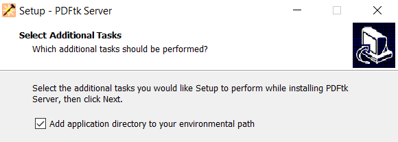

# PDFtk Server Notes

[PDFtk Server](https://www.pdflabs.com/tools/pdftk-server/) is a program that can password-protect, merge, and split PDF files (among other things).

This document describes basic use of PDKtk on Windows and makes no assumptions regarding prior experience with PDFtk Server or with [command-line applications](https://en.wikipedia.org/wiki/Command-line_interface) in general.

For a full description of PDFtk Server's capabilities, consult [its manual](https://www.pdflabs.com/docs/pdftk-man-page/).

## Installing PDFtk Server

* Go to https://www.pdflabs.com/tools/pdftk-server/.
* Download and run the installer (as of December 2021, the download links are about halfway down the page).
  * The default installation directory is `C:\Program Files (x86)\PDFtk Server`.
  * The installer will add this directory to [the path](https://en.wikipedia.org/wiki/PATH_(variable)) by default. This allows Windows to find PDFtk Server without the user having to specify the full path to it.

## Using PDFtk Server

PDFtk Server uses a [command-line interface](https://en.wikipedia.org/wiki/Command-line_interface). Although there's a version of PDFtk with a graphical user interface, a licence fee must be paid to unlock its full functionality.

Before using PDFtk Server (hereafter referred to simply as "PDFtk"), you need to be able to give it commands using the command prompt or a PowerShell window ([PowerShell](https://en.wikipedia.org/wiki/PowerShell) is a newer, more capable version of the command prompt, but is equivalent to the command prompt in this context).

* Open a command prompt or a PowerShell window.
  * One way to open a command prompt:
    * Open the start menu.
    * Type "cmd" or "command prompt".
    * Select "Command Prompt".
  * One way to open a PowerShell window:
    * Open a folder in File Explorer.
    * Ensure no files are selected by clicking in an empty area.
    * Hold the shift key and right-click within a folder.
    * Select "Open a PowerShell window here".
    * Alternatively, you can use the start menu method described above for the command prompt, but type "powershell" instead of "cmd".
* Type `pdftk` and hit enter.
  * If you see a list of options, the system knows where PDFtk is located and you can proceed to [the "Obtaining File and Folder Paths" section](#obtaining-file-and-folder-paths).
  * If you see a message like:
      
      > 'pdftk' is not recognized as [...]
      
      then PDFtk isn't on the path. See the next section, "If PDFtk Isn't on the Path".

## If PDFtk Isn't on the Path

If the directory containing PDFtk isn't on the path, Windows won't be able to find it.

There are three main ways to deal with this:
* Re-run the installer and ensure that the option to add PDFtk's installation directory to the path is enabled.
    
* Include the full path to the PDFtk executable whenever you use it (instead of just `pdftk`). If PDFtk was installed in the default location, the full path is `"C:\Program Files (x86)\PDFtk Server\bin\pdftk.exe"`. The quotation marks are necessary because this path contains spaces.
* Every time you open a command prompt or PowerShell window and intend to use PDFtk, change the [working directory](https://en.wikipedia.org/wiki/Working_directory) to the directory containing PDFtk by executing the command `cd "C:\Program Files (x86)\PDFtk Server\bin"`.

Unless you have a reason for not wanting the PDFtk directory on the path (e.g., another program that's somewhat improbably *also* called pdftk is already on the path), the first option is probably the best one.

## Obtaining File and Folder Paths

When using PDFtk, you'll need to specify the paths to input files you want it to process and the paths of output files you want it to create. The path of an output file that doesn't yet exist can be obtained by taking a folder path and appending a slash and the name of a file it doesn't contain.

To obtain the path for a file:

* Open File Explorer and navigate to the folder containing the file.
* Select the file.
* Hold the shift key and right-click on the file.
* Select "Copy as path" from the context menu.
* Open a text editor and perform the paste operation (press Ctrl + V or select *Edit > Paste*).
  * Notepad or [Notepad++](https://notepad-plus-plus.org/) are both suitable text editors for this purpose. I recommend the latter, but the former comes installed with Windows (which is convenient) and is sufficient for this purpose.

To obtain a folder path:

* Open File Explorer and navigate to the folder.
* Click in the location bar (this is the rectangular field near the top of the File Explorer window that lists all the folders leading to the current one). The path should become selected.
* Copy the path (press Ctrl + C or right-click on it and select "Copy" from the context menu).
* Open a text editor and perform the paste operation (press Ctrl + V or select *Edit > Paste*).

Although paths on Windows usually use a backslash character (`\`) to separate each item, regular slashes (`/`) - which are used by most other operating systems - also work.

## Commands for Specific Tasks

In practical terms, a command is a line of text typed (or pasted) into a command prompt or PowerShell window. Commands are executed by pressing enter.

I recommend preparing commands in a text editor (like Notepad or Notepad++; see the "Obtaining File Paths" section above) and then copying and pasting them into the command prompt/PowerShell window.

In the commands described below, any text within triangle brackets should be replaced by the actual value it describes. For example, `<path to input file>` might be replaced by `"C:\important information\Rodents of the World.pdf"`.

### Adding a Password to a PDF

What you need:

* The path to the input file: the path to the PDF to which you wish to add a password.
* The path to the output file: the path to the file you want PDFtk to create.
* A user password: the password other people will use to access the PDF.
* An owner password: the password required to edit the PDF.

General form of the command:

```
pdftk <path to input file> output <path to output file> owner_pw <owner password> user_pw <user password>
```

If a password contains spaces, enclose it in quotation marks.

If you want to allow someone who opens the PDF to print it, append `allow printing` to the command:

```
pdftk <path to input file> output <path to output file> owner_pw <owner password> user_pw <user password> allow printing
```

Example:

```
pdftk "C:\Test files\document.pdf" output "C:\Test files\password-protected document.pdf" owner_pw "space shuttle" user_pw spacelab
```

Note that the user password, `spacelab`, doesn't need to be enclosed in quotation marks since it doesn't contain any spaces.

---

**IMPORTANT SECURITY NOTE:** You'll need to provide the user password to other people using a sufficiently-secure means of communication such as an in-person conversation or a phone call. **Never include the password in an email unless that email is encrypted.** Emails are delivered from server to server using [Simple Mail Transfer Protocol](https://en.wikipedia.org/wiki/Simple_Mail_Transfer_Protocol), which is not encrypted or otherwise secured by default. This means that an email is like a postcard: unless it's encrypted, it can be read at any point during the delivery process. For more information, I recommend reading about public-key encryption; [the relevant Wikipedia article is a good place to start](https://en.wikipedia.org/wiki/Public-key_cryptography).

---

### Merging Multiple PDFs into a Single PDF

What you need:

* The paths to the input files.
* The path to the output file.

General form of the command:

```
pdftk <path to first input file> <path to second input file> <additional input file paths as necessary> cat output <path to output file>
```

Example:

```
pdftk "C:\animal lists\List of rodents.pdf" "C:\data\rodents-ordered-by-weight.pdf" "C:\data\rodents-ordered-by-prevalence.pdf" cat output "C:\Documents to send to everyone I know\RODENTS.pdf"
```

Note: `cat` is an abbreviation of the word "concatenate", which means "to join or link together". A notable use of this abbreviation is [Unix's cat utility](https://en.wikipedia.org/wiki/Cat_(Unix)).

### Splitting a PDF into Multiple PDFs

What you need:

* The path to the input file.
* The page range you wish to extract from the input file.
  * Page ranges are inclusive and consist of the numbers of the start and end pages, separated by a hyphen (e.g., `3-5`).
  * If you wish to extract a single page, you may omit the hyphen and the end page number (e.g., `5`), although specifying the same value for the start and end page numbers (e.g., `5-5`) will also work.
* The paths to the output files.

General form of the command:

```
pdftk <path to input file> cat <page range> output <path to output file>
```

Example:

```
pdftk "C:\Test files\document.pdf" cat 3-5 output "C:\Test files\pages 3 through 5 of the document.pdf"
```

PDFtk's `cat` operation is quite versatile; for a complete description of its capabilities, see [the PDFtk manual](https://www.pdflabs.com/docs/pdftk-man-page/).